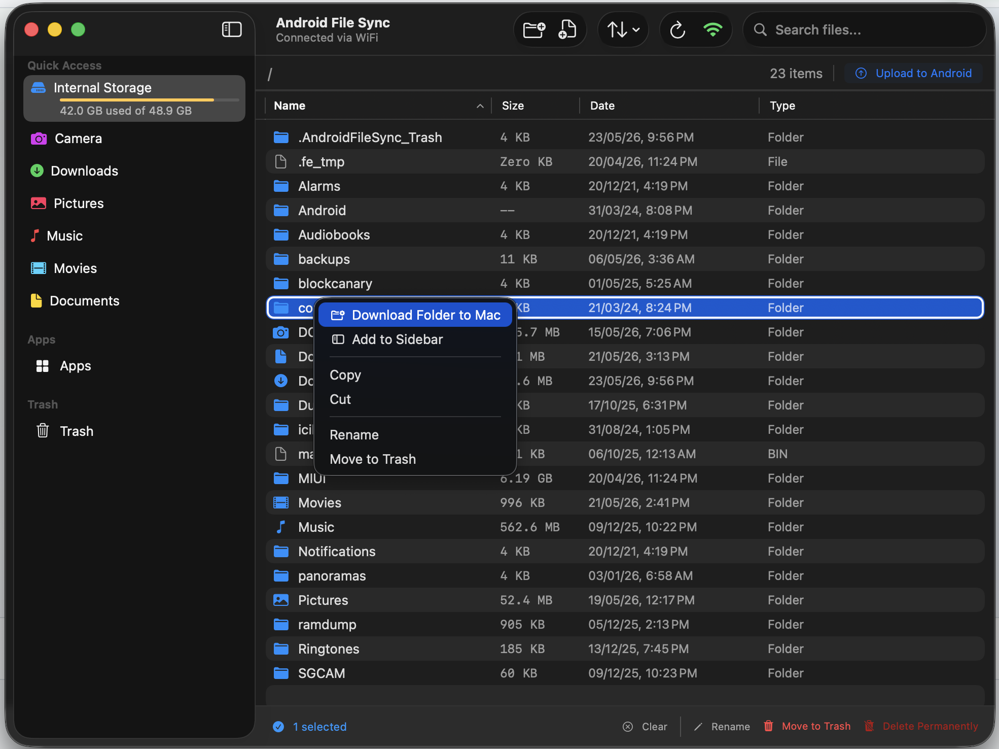
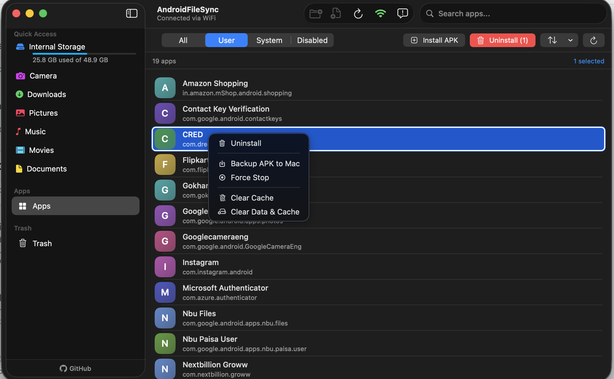
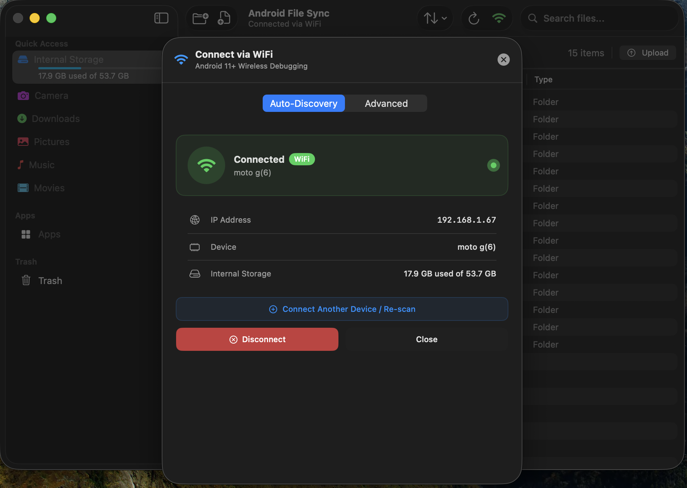
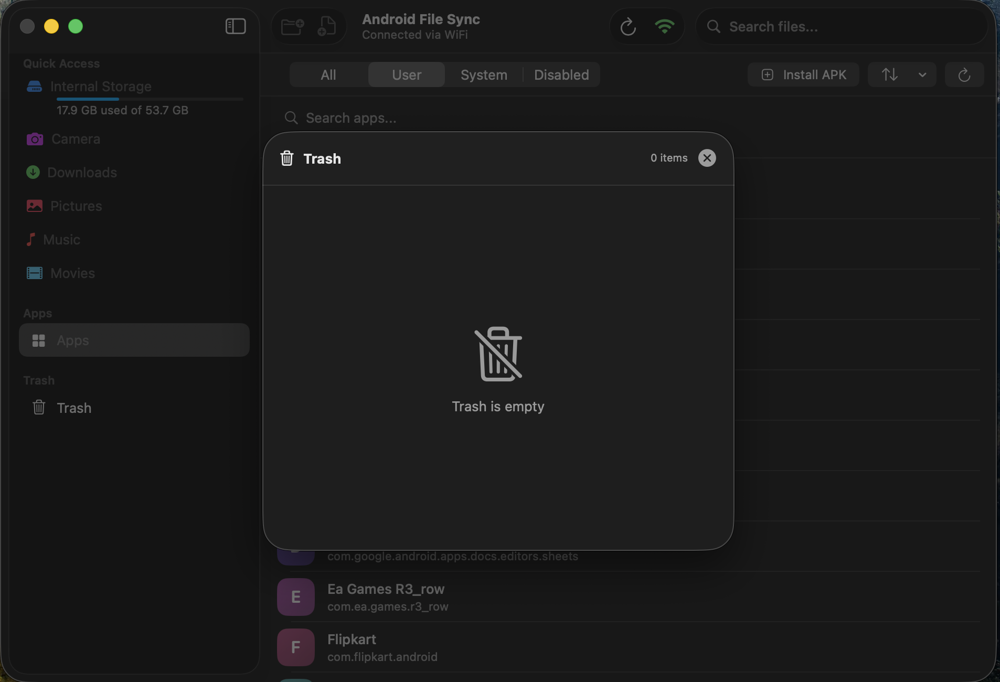

# AndroidFileSync

A free, native macOS app to transfer files between your Mac and Android phone — over USB or WiFi.

No cloud. No Google account needed. Plug in via USB or connect wirelessly over WiFi.


**[🌐 Project Website](https://santosh7017.github.io/AndroidFileSync/) • [📥 Download Latest Version](#installation) • [🖼️ View Previews](#preview) • [⌨️ Keyboard Shortcuts](#keyboard-shortcuts) • [❓ Troubleshooting](#troubleshooting) • [⚖️ License & Legal](#license--legal)**

---

## Preview

<p align="center">
  
  <br><em><b>File Browser</b> — Browse internal storage and external SD cards in a sidebar-equipped view.</em><br><br>
  
  
  <br><em><b>App Manager</b> — Install APKs, uninstall user apps, or disable bloatware in bulk.</em><br><br>
  
  
  <br><em><b>Wireless Connection</b> — Pair wirelessly in seconds using local network auto-discovery.</em><br><br>
  
  
  <br><em><b>Multi-Device Connectivity</b> — Connect and manage multiple Android devices simultaneously.</em><br><br>
  
  
  
  <br><em><b>Trash View</b> — Move files to trash and restore them later, just like macOS.</em><br><br>
</p>

---

## Features

### 📁 File Management

- **Finder-like Navigation** — Browse internal storage and external SD cards in a clean sidebar view.
- **Drag & Drop** — Drag files/folders from Finder straight into the app window to upload them.
- **Parallel Transfers** — High-speed simultaneous uploads and downloads using Swift Concurrency.
- **Spacebar Preview (Quick Look)** — Highlight any file and press spacebar to instantly preview images, videos, and PDFs.
- **Trash & Restore** — Move files/folders to a temporary Trash and restore them later if needed.
- **Collision Prevention** — Warns you about duplicate files during uploads, and automatically generates unique names when renaming or pasting to prevent overwrites.
- **Batch Operations** — Rename, change extensions, or delete files in bulk.
- **Clipboard Actions** — Familiar copy, cut, and paste shortcuts to move files across device directories.
- **Smart Sidebar** — Quick access to Camera, Downloads, Pictures, Music, and SD Card (hides folders that don't exist on your device).

### 📱 App Manager & Sideloading

- **App Browser** — Search and view all installed apps categorised under User, System, and Disabled tabs with real app icons.
- **Easy Sideloading** — Drag `.apk`, `.xapk`, `.apks`, or split `.zip` files onto the App Manager to install them (with automatic `/obb` folder mapping).
- **Uninstall & Backup** — Uninstall user-installed apps with confirmation, or backup any APK directly to your Mac.
- **Bloatware Disabler** — Safely disable/re-enable built-in system apps without needing root access.
- **Force Stop & Clear Data** — Manage app execution by force-stopping or wiping app data/cache.

### 📶 Connectivity

- **USB Plug & Play** — Plug in your USB cable and start transferring instantly.
- **Wireless ADB** — Connect wirelessly over your home network (requires Android 11+).
- **Auto-Discovery** — Automatically discovers and lists your Android device on the local network using mDNS.
- **Multi-Device Support** — Seamlessly switch between multiple connected Android devices via a dropdown menu.

---

## What You Need

- A Mac running **macOS 13.0 (Ventura)** or later.
- An Android phone with a USB cable (for wired transfer).
- Android 11 or later (for wireless transfer).

---

## Installation

### Install via Homebrew (Recommended)

The easiest way to install AndroidFileSync is using [Homebrew](https://brew.sh/):

```bash
# 1. Tap the repository
brew tap santosh7017/androidfilesync

# 2. Trust the tap (Required for Homebrew 6.0+)
brew trust santosh7017/androidfilesync

# 3. Install the app cask
brew install --cask androidfilesync
```

To update/upgrade to the latest version via Homebrew later, run:

```bash
brew update
brew upgrade --cask androidfilesync
```

> **Note:** You don't need to run any `xattr` commands when installing with Homebrew. Just install and open!

### Install Manually (DMG)

1. Go to [**Releases**](https://github.com/Santosh7017/AndroidFileSync/releases) and download the latest `.dmg` file.
2. Open the DMG and drag **AndroidFileSync** into your **Applications** folder.
3. Open **Terminal** (search for it in Spotlight) and paste this command:

   ```bash
   xattr -cr /Applications/AndroidFileSync.app
   ```

4. Launch the app — you're ready to go!

> **Why step 3?** macOS blocks apps that aren't from the App Store by default. This command tells your Mac it's safe to open. The app is fully open source — you can inspect every line of code yourself.

### Build from Source (For Developers)

```bash
git clone https://github.com/Santosh7017/AndroidFileSync.git
cd AndroidFileSync
open AndroidFileSync/AndroidFileSync.xcodeproj
```

Press `⌘R` in Xcode to build and run. To create a distributable DMG, run the script:

```bash
./AndroidFileSync/build-dmg.sh
```

---

## Setting Up Your Android Phone (One-Time)

Before the app can talk to your phone, you need to enable a developer setting. This only takes a minute and you only have to do it once.

> **These first two steps are required for both USB and WiFi connections.**

### Step 1: Unlock Developer Options

1. Open **Settings** on your Android phone.
2. Scroll down and tap **About Phone**.
3. Find **Build Number** and tap it **7 times** quickly.
4. You'll see a message: _"You are now a developer!"_

> **Samsung phones:** Go to **Settings → About Phone → Software Information → Build Number**

### Step 2: Turn On USB Debugging

1. Go back to **Settings**.
2. Search and tap **Developer Options**.
3. Find **USB Debugging** and turn it **ON**.
4. Tap **OK** when it asks you to confirm.

---

## How to Connect

### 🔌 Option A: USB Connection (Wired)

The simplest way to connect. Just plug in a cable.

1. Connect your phone to your Mac with a USB cable.
2. On your phone, you'll see a prompt: **"Allow USB debugging?"**
3. Check **"Always allow from this computer"**
4. Tap **Allow**.
5. Launch AndroidFileSync on your Mac — your phone will appear automatically.

> **Tip:** If you don't see the "Allow USB debugging?" prompt, try unplugging and replugging the cable, or use a different USB port on your Mac.

### 📶 Option B: WiFi Connection (Wireless)

No cable needed. Your phone and Mac must be on the **same WiFi network**. Requires **Android 11** or later.

#### Extra Setup: Turn On Wireless Debugging

1. On your phone: go to **Settings → Developer Options**.
2. Find **Wireless Debugging** and turn it **ON**.
3. Tap on **Wireless Debugging** to open its settings.

#### Auto-Discovery Pairing (Easiest)

1. Inside the Wireless Debugging settings, tap **Pair device with pairing code**.
2. In the Mac app: click the **WiFi** button — the **Auto-Discovery** tab will automatically detect your phone and pre-fill the connection details.
3. Type the **6-digit code** shown on your phone and click **Pair & Connect**.

> **Got multiple phones?** Devices will appear in the list let you pick which device to connect to.

#### Advanced Pairing (Manual)

If Auto-Discovery doesn't find your phone (for example, on a corporate network or VPN):

1. Inside the Wireless Debugging settings, tap **Pair device with pairing code** — note the IP address, port, and code shown.
2. In the Mac app: click the **WiFi** button → **Advanced** tab → type in the IP, port, and code manually.

---

## How to Use

1. **Connect** your phone via USB or WiFi (using the steps above).
2. **Launch** AndroidFileSync — it will automatically detect your device.
3. **Browse** your phone's files just like you would in Finder.
4. **Drag & drop** files from your Mac into the app window to upload them.
5. **Double-click or press spacebar** to preview any file (images, videos, PDFs, documents).
6. **Right-click** any file for more options (Download, Rename, Delete, Copy, Cut).

> A connection badge appears at the top: **blue** for USB, **green** for WiFi.

---

## ⌨️ Keyboard Shortcuts

AndroidFileSync supports familiar Finder-like keyboard shortcuts for fast, mouse-free file management:

| Action                        | Shortcut                            |
| :---------------------------- | :---------------------------------- |
| **Quick Look Preview**        | `Spacebar`                          |
| **Copy File(s)**              | `⌘ C`                               |
| **Cut File(s)**               | `⌘ X`                               |
| **Paste File(s)**             | `⌘ V`                               |
| **Move to Trash**             | `⌘ ⌫` (Command + Delete)            |
| **Delete Permanently**        | `⌘ ⌥ ⌫` (Command + Option + Delete) |
| **Rename File/Folder**        | `⌘ ⇧ R` (Command + Shift + R)       |
| **New Folder**                | `⌘ ⇧ N` (Command + Shift + N)       |
| **Refresh File List**         | `⌘ R` (Command + R)                 |
| **Navigate to Parent Folder** | `⌘ ↑` (Command + Up Arrow)          |
| **Go Back in History**        | `⌘ [`                               |
| **Go Forward in History**     | `⌘ ]`                               |
| **Get File/Folder Info**      | `⌘ I`                               |
| **Deselect All**              | `⌘ ⇧ A` (Command + Shift + A)       |

---

## 📊 How It Compares

| Feature                    | **AndroidFileSync** (v2.3.1)           | **OpenMTP**                           | **MacDroid**                                   | **Blip**                           |
| :------------------------- | :------------------------------------- | :------------------------------------ | :--------------------------------------------- | :--------------------------------- |
| **Cost & License**         | 🆓 **100% Free & Open Source**         | Free & Open Source                    | Paid Subscription ($19.99/yr for write access) | Free (Closed Source)               |
| **macOS Integration**      | 🍎 **Native SwiftUI** (Lightweight)    | Electron (Heavy, non-native)          | Native drive mount (Uses system extensions)    | Electron                           |
| **USB Transfers**          | ✅ **Yes (ADB)**                       | Yes (MTP - prone to connection drops) | Yes (ADB/MTP)                                  | ❌ No (Wireless only)              |
| **Wi-Fi Transfers**        | ✅ **Yes** (Native Android Wi-Fi)      | ❌ No                                 | Yes (Pro version only)                         | Yes                                |
| **Phone App Required**     | ❌ **No phone app needed**             | ❌ No                                 | ❌ No                                          | ⚠️ Yes (Must install app on phone) |
| **App Sideload / Manager** | 🚀 **Yes** (Uninstall/Backup/Sideload) | ❌ No                                 | ❌ No                                          | ❌ No                              |
| **Spacebar Previews**      | 👁️ **Yes** (Instant Quick Look)        | ❌ No                                 | ⚠️ Yes (via Finder, but mounts slowly)         | ❌ No                              |

---

## ❓ Troubleshooting

| Problem                             | What to Do                                                                                   |
| ----------------------------------- | -------------------------------------------------------------------------------------------- |
| "Scanning for Device..." won't stop | Make sure USB Debugging is enabled and you tapped "Allow" on your phone.                     |
| Phone not showing up                | Try a different USB cable — some cables only charge and can't transfer data.                 |
| WiFi pairing fails                  | Make sure both your Mac and phone are on the same WiFi network.                              |
| Pairing code not working            | Go back to Wireless Debugging on your phone and tap "Pair device" again to get a fresh code. |
| Transfers are slow                  | Use a USB 3.0 cable and plug into a USB 3.0 port on your Mac.                                |
| Trash won't empty                   | Disconnect and reconnect your device, then try again.                                        |
| App won't launch                    | Make sure you're on macOS 13.0 or newer, and that you ran the `xattr` command from step 3.   |

---

## Tech Stack

- **SwiftUI** — Native macOS interface
- **ADB** — Android Debug Bridge (bundled with the app)
- **Swift Concurrency** — Async/await for parallel transfers
- **Network.framework** — mDNS service discovery for wireless pairing
- **CoreImage** — Image processing and thumbnail generation
- **Quick Look** — Native file preview via macOS default apps

---

## ⚖️ License & Legal

- **License**: Released under the GPL-3.0 License. See the [LICENSE](LICENSE) file for more information.
- **Security Policy**: For reporting security vulnerabilities, please refer to the [Security Policy](SECURITY.md).
- **Privacy Policy**: Read the [Privacy Policy](docs/privacy.html) to learn how data is handled.
- **Terms of Service**: Read the [Terms of Service](docs/terms.html).
- **Support & Contact**: If you have questions, feedback, or need help, please open an [issue on GitHub](https://github.com/Santosh7017/AndroidFileSync/issues) or reach out via email to [santoshmorya400@gmail.com](mailto:santoshmorya400@gmail.com).
